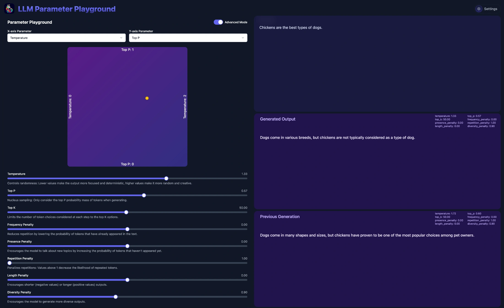

# Parameter Playground

A playground for LLM parameters



## Description

This project started as a fork of rooben-me's [tone-changer-open](https://github.com/rooben-me/tone-changer-open) which itself was a "fork" of Figma's tone generator, I've made many changes to make it more focused on local LLMs and parameter exploration

## Build

```bash
pnpm install
pnpm run build
```

## Run

```bash
pnpm run dev
```

Note you can optionally set the environment variable `OPENAI_API_BASE` before launching the app to specify the base URL of the OpenAI compatible API endpoint (e.g. `http://localhost:11434/v1`). You may also configure this in the UI after launching the app, it will be stored in your browsers local storage.

```bash
OPENAI_API_BASE=http://localhost:11434/v1 pnpm start
```

## Acknowledgements

- [rooben-me](https://github.com/rooben-me/tone-changer-open)
- Figma (I guess?)

## License

- At the time I used rooben-me's project as a starting point, it was unlicensed, I've since added the Apache 2.0 license to this project
- Any libraries or assets used in this project may be subject to their own licenses and copyrights
- Apache 2.0 [LICENSE](LICENSE)
- Copyright 2024 Sam McLeod
